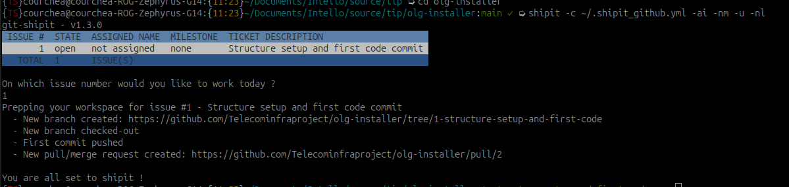

# Installer for OpenLAN Gateway

Project aimed at building ISOs for OpenLAN Gateway

## Requirements

- Docker
- Linux or macOS operating system (sorry not sorry Windows)

## Building an ISO

1. Run `script/build`

The result of this will be an ISO in the project working folder.

## Installing OpenLAN Gateway

### Install from ISO and VyOS VM configuration
- Boot on the ISO, once the install is completed the server will power-off
- Power back the server
- Login to the Linux host with username `olgadm` and password `olgadm`
- Edit `/opt/staging_scripts/setup-config` and adjust the network interface names and if required the VyOS VM sizing parameters
    - If you will be using the "Standalone mode", you might need to adjust the VyOS rolling release path. Reference: https://github.com/vyos/vyos-nightly-build/releases
- Run the setup script:
    - `sudo /opt/staging_scripts/setup-vyos-bridge.sh` to use the network bridge method
    - `sudo /opt/staging_scripts/setup-vyos-hw-passthru.sh` to use the hardware passthru for the network interfaces (WIP, not tested)
- Reboot the host
- Connect to the VyOS console with `virsh console vyos`
- Login with username `vyos` and password `vyos`
- Type `install image` and press Enter.
- Follow the prompts (you can use all defaults)
- Once completed, type `reboot` to reboot the VM
- For some reason the VyOS VM does not reboot after this first `reboot` command. You must restart it manually with `virsh start vyos`

## Configuration options

At this time you can either load a default configuration and use VyOS in a "standalone" mode or have it connected to an OpenWifi Cloud SDK instance.

### OpenWifi Cloud SDK mode

#### VyOS Minimal Configuration

Before setting up the uCentral client, configure VyOS with minimal settings required for cloud management:

```
configure

# Enable DHCP on WAN interface (br0)
set interfaces bridge br0 address dhcp

# Enable HTTPS API service
set service https

# Enable REST API endpoint (required for uCentral configuration management)
# The REST endpoint allows the uCentral client to push configurations via API
set service https api rest

# Set API key (use a secure key in production)
set service https api keys id ucentral key 'MY-HTTPS-API-PLAINTEXT-KEY'

commit
save
exit
```

**Note on REST API**: The `rest` endpoint is required because uCentral uses the `/config-file` API to push complete configurations in a single transaction. Without REST enabled, the API will reject configuration requests. The API key set here must match the `key` value in `/etc/ucentral/vyos-info.json` inside the ucentral-olg container.

#### Setup of Ucentral-Client Container

- SSH to the OLG Ubuntu host
- Run `sudo /opt/staging_scripts/ucentral-setup.sh setup` to setup the ucentral-client container
    - You can also use the following parameters for the `ucentral-setup.sh` script:
        - `shell`: To get access to ucentral container.
        - `cleanup`: To clean the setup.
- Copy your certificates to olg and  then to container at `/etc/ucentral` in order to work with your cloud-controller.
    - `sudo docker cp cert.pem ucentral-olg:/etc/ucentral/operational.pem`
    - `sudo docker cp cas.pem ucentral-olg:/etc/ucentral/operational.ca`
    - `sudo docker cp key.pem ucentral-olg:/etc/ucentral/`
- Run `sudo /opt/staging_scripts/ucentral-setup.sh shell` to get shell access to the ucentral container and perform the following tasks:
    - Modify `/etc/ucentral/vyos-info.json` and update `host` value to the IP address assigned to the VyOS VM br-wan interface.
    - Start the ucentral-client:
        - Debug mode: `SERIALNUM=my_olg_serial ; URL=my_cloudsdk_uri ; /usr/sbin/ucentral -S $SERIALNUM -s $URL -P 15002 -d`
        - Deamonized mode: `SERIALNUM=my_olg_serial ; URL=my_cloudsdk_uri ; /usr/sbin/ucentral -S $SERIALNUM -s $URL -P 15002 -d &`
        - For example `SERIALNUM=74d4ddb965dc` for which certs are generated, `URL=openwifi1.routerarchitects.com`, for your OpenWifi Cloud SDK instance.

> [!WARNING]
> Ucentral Client must be started only after VyOS gets started.
>
> There is a bit of a chicken-and-the-egg scenario if the OLG device was never seen by the OpenWifi Cloud SDK instance. A blank configuration will be pushed to VyOS and the connection with the ucentral client might be broken.
>
> At this time the order of execution should be the following if the OLG device was never seen by the OpenWifi Cloud SDK instance:
> - Stop the VyOS VM with `virsh shutdown vyos`
> - Start the ucentral-client
> - Populate a configuration in the OpenWifi Cloud SDK for the OLG device
> - Restart the VyOS VM with `virsh start vyos`
> - If IP Address of VyOS VM gets changed then reconfigure value of `host` in `/etc/ucentral/vyos-info.json` , in ucentral and restart ucentral client.


### Standalone mode

The factory configuration consists of:

- `eth0` as the WAN interface in DHCP
- `eth1` as the LAN interface
- 3 VLANs:
    - VLAN 100 for the switches
    - VLAN 101 for the APs
    - VLAN 1000 for the guest devices
- Each VLAN has it's own DHCP scope

Here is how to load this configuration:

- Open a console to the VyOS console with `virsh console vyos`
- If required login with your credentials
- Mound the ISO containing the configs
    ```
    sudo mkdir /opt/vyos-configs ; sudo mount /dev/sr1 /opt/vyos-configs
    ```
- Go in config mode with `config`
- Load the factory config with:
    ```
    source /opt/olg-configs/vyos-factory-config
    commit
    save
    exit
    ```

## Sample UCentral configurations

Here are some sample configuration(s)

| File path | Description |
|-----------|-------------|
| [mdu.json](sample-configurations/mdu.json) | MDU configuration with two VLAN networks and also adhere to olg ucentral schema enhancement for NAT object as proposed in [olg-ucentral-schema ra_proposal branch](https://github.com/Telecominfraproject/olg-ucentral-schema/tree/ra_proposal) |

## Tested platforms

- MinisForum MS-01

## Contributing

- Create an issue
- Create a branch and an assoiated PR
- Code
- Ask for review and get your changes merged

## Protip

Use the Shipit CLI (https://gitlab.com/intello/shipit-cli-go)

This allows you to create the branch and associated PR in one simple command. The branch and PR will use a standardized naming scheme.




